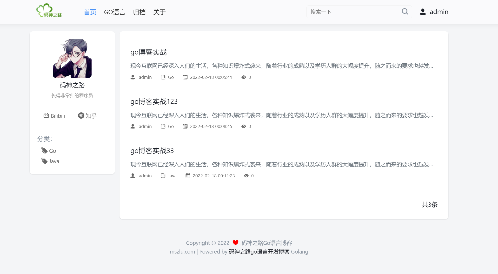

# 初识Go博客

Go博客实战教程，是一个练手级项目教程，使用原生Go开发，未使用任何框架。

**学习本项目能学到什么？**

* 如何使用原生Go开发一个web项目
* 循序渐进，掌握编程思维和思路
* 初步具有工程思维，能适应一般的开发工作

> main函数和init函数什么区别？

在Go语言中，`main`函数和`init`函数扮演着不同的角色，它们的用途和执行时机有所区别：

### main函数

1. **定义**：`main`函数是每个可执行Go程序的入口点。每个Go程序都必须包含一个`main`函数，且该函数没有参数也不返回任何值（签名是`func main()`）。
2. **作用**：`main`函数负责启动程序的执行流程，通常在这里调用其他函数来完成程序的主要任务。
3. **执行时机**：当Go程序开始运行时，所有的初始化工作（包括包级别的`init`函数）完成后，才会执行`main`函数。
4. **退出**：当`main`函数执行完毕，程序也随之结束。

### init函数

1. **定义**：`init`函数是在每个包中可选定义的，它可以有任意数量，且每个`init`函数都没有参数和返回值（签名是`func init()`）。
2. **作用**：`init`函数主要用于执行包的初始化操作，比如初始化变量、数据库连接、日志设置等。这些操作在程序真正开始运行（即执行`main`函数）之前完成。
3. **执行时机**：当一个包被导入时，其所有的`init`函数会按照导入顺序依次执行。这意味着依赖关系较早导入的包的`init`函数会先于依赖它后面的包执行。整个程序开始执行前，所有导入包的`init`函数都会被执行完毕。
4. **自动调用**：程序员不需要手动调用`init`函数，Go运行时会自动执行它们。

### 总结

- `main`函数是程序的起点，是用户编写程序逻辑的中心。
- `init`函数则提供了一种机制，用于在程序主体开始执行前进行必要的初始化工作，且这些初始化操作对包外部是透明的。
- `init`函数的执行顺序保证了程序在`main`函数执行前已经处于一个正确初始化的状态。

## 1. 搭建项目

~~~go
package main

import (
	"encoding/json"
	"log"
	"net/http"
)

type IndexData struct {
	Title string `json:"title"`
	Desc string `json:"desc"`
}
func index(w http.ResponseWriter,r *http.Request)  {
	w.Header().Set("Content-Type","application/json")
	var indexData IndexData
	indexData.Title = "go博客"
	indexData.Desc = "现在是入门教程"
	jsonStr,_ := json.Marshal(indexData)
	w.Write(jsonStr)
}

func main()  {
	//程序入口，一个项目 只能有一个入口
	//web程序，http协议 ip port
	server := http.Server{
		Addr: "127.0.0.1:8080",
	}
	http.HandleFunc("/",index)
	if err := server.ListenAndServe();err != nil{
		log.Println(err)
	}
}

~~~

## 2. 响应页面

~~~go
func indexHtml(w http.ResponseWriter,r *http.Request)  {
	t := template.New("index.html")
	viewPath, _ := os.Getwd()
	t,_ = t.ParseFiles(viewPath + "/template/index.html")
	var indexData IndexData
	indexData.Title = "go博客"
	indexData.Desc = "现在是入门教程"
	err := t.Execute(w,indexData)
	fmt.Println(err)
}

func main()  {
	//程序入口，一个项目 只能有一个入口
	//web程序，http协议 ip port
	server := http.Server{
		Addr: "127.0.0.1:8080",
	}
	http.HandleFunc("/",index)
	http.HandleFunc("/index.html",indexHtml)
	if err := server.ListenAndServe();err != nil{
		log.Println(err)
	}
}
~~~

~~~html
<!DOCTYPE html>
<html lang="en">
<head>
    <meta charset="UTF-8">
    <title>Title</title>
</head>
<body>
 hello mszlu blog!!
{{.Title}}
 {{.Desc}}
</body>
</html>
~~~

## 3. 首页

### 3.1 页面解析

~~~go
func index(w http.ResponseWriter,r *http.Request)  {
	var indexData IndexData
	indexData.Title = "go博客"
	indexData.Desc = "现在是入门教程"
	t := template.New("index.html")
	//1. 拿到当前的路径
	path,_ := os.Getwd()
	//访问博客首页模板的时候，因为有多个模板的嵌套，解析文件的时候，需要将其涉及到的所有模板都进行解析
	home := path + "/template/home.html"
	header := path + "/template/layout/header.html"
	footer := path + "/template/layout/footer.html"
	personal := path + "/template/layout/personal.html"
	post := path + "/template/layout/post-list.html"
	pagination := path + "/template/layout/pagination.html"
	t,_ = t.ParseFiles(path + "/template/index.html",home,header,footer,personal,post,pagination)

	//页面上涉及到的所有的数据，必须有定义
	t.Execute(w,indexData)
}
~~~

### 3.2 首页数据格式定义

config/config.go

~~~go
package config

type Viewer struct {
	Title string
	Description  string
	Logo  string
	Navigation  []string
	Bilibili string
	Avatar string
	UserName string
	UserDesc string
}
type SystemConfig struct {
	AppName             string
	Version             float32
	CurrentDir          string
	CdnURL string
	QiniuAccessKey string
	QiniuSecretKey string
	Valine bool
	ValineAppid string
	ValineAppkey string
	ValineServerURL string
}
~~~

models/category.go

~~~go
package models

type Category struct {
	Cid      int
	Name     string
	CreateAt string
	UpdateAt string
}
~~~

models/post.go

~~~go
package models

import (
	"goblog/config"
	"html/template"
	"time"
)

type Post struct {
	Pid        int    `json:"pid"`                // 文章ID
	Title      string `json:"title"`            // 文章ID
	Slug       string `json:"slug"`              // 自定也页面 path
	Content    string `json:"content"`        // 文章的html
	Markdown   string `json:"markdown"`      // 文章的Markdown
	CategoryId int    `json:"categoryId"` //分类id
	UserId     int    `json:"userId"`         //用户id
	ViewCount  int    `json:"viewCount"`   //查看次数
	Type       int    `json:"type"`              //文章类型 0 普通，1 自定义文章
	CreateAt   time.Time `json:"createAt"`     // 创建时间
	UpdateAt   time.Time `json:"updateAt"`     // 更新时间
}

type PostMore struct {
	Pid          int    `json:"pid"`                    // 文章ID
	Title        string `json:"title"`                // 文章ID
	Slug         string `json:"slug"`                  // 自定也页面 path
	Content      template.HTML `json:"content"`            // 文章的html
	CategoryId   int    `json:"categoryId"`     // 文章的Markdown
	CategoryName string `json:"categoryName"` // 分类名
	UserId       int    `json:"userId"`             // 用户id
	UserName     string `json:"userName"`         // 用户名
	ViewCount    int    `json:"viewCount"`       // 查看次数
	Type         int    `json:"type"`                  // 文章类型 0 普通，1 自定义文章
	CreateAt     string `json:"createAt"`
	UpdateAt     string `json:"updateAt"`
}

type PostReq struct {
	Pid        int    `json:"pid"`
	Title      string `json:"title"`
	Slug       string `json:"slug"`
	Content    string `json:"content"`
	Markdown   string `json:"markdown"`
	CategoryId int    `json:"categoryId"`
	UserId     int    `json:"userId"`
	Type       int    `json:"type"`
}

type SearchResp struct {
	Pid   int    `orm:"pid" json:"pid"` // 文章ID
	Title string `orm:"title" json:"title"`
}

type PostRes struct {
	config.Viewer
	config.SystemConfig
	Article PostMore
}
~~~

models/home.go

~~~go
package models

type HomeData struct {
	config.Viewer
	Categorys []Category
	Posts []PostMore
	Total int
	Page int
	Pages []int
	PageEnd bool
}
~~~

## 4. 配置文件读取

config.toml:

~~~toml
[viewer]
    Title = "Go语言博客"
    Description = "Go语言博客"
    Logo = "/resource/images/logo.png"
    Navigation = ["首页","/", "GO语言","/golang", "归档","/pigeonhole", "关于","/about"]
    Bilibili = "https://space.bilibili.com/473844125"
    Zhihu = "https://www.zhihu.com/people/ma-shen-zhi-lu"
    Avatar = "https://gimg2.baidu.com/image_search/src=http%3A%2F%2Finews.gtimg.com%2Fnewsapp_bt%2F0%2F13147603927%2F1000.jpg&refer=http%3A%2F%2Finews.gtimg.com&app=2002&size=f9999,10000&q=a80&n=0&g=0n&fmt=jpeg?sec=1647242040&t=c6108010ed46b4acebe18955acdd2d24"
    UserName = "张三"
    UserDesc = "长得非常帅的程序员"
[system]
    CdnURL = "https://static.mszlu.com/goblog/es6/md-assets"
    QiniuAccessKey = "替换自己的"
    QiniuSecretKey = "替换自己的"
    Valine = true
    ValineAppid = "替换自己的"
    ValineAppkey = "替换自己的"
    ValineServerURL = "替换自己的"
~~~

~~~go
package config

import (
	"github.com/BurntSushi/toml"
	"os"
)

type TomlConfig struct {
	Viewer Viewer
	System SystemConfig
}
type Viewer struct {
	Title string
	Description  string
	Logo  string
	Navigation  []string
	Bilibili string
	Avatar string
	UserName string
	UserDesc string
}
type SystemConfig struct {
	AppName             string
	Version             float32
	CurrentDir          string
	CdnURL string
	QiniuAccessKey string
	QiniuSecretKey string
	Valine bool
	ValineAppid string
	ValineAppkey string
	ValineServerURL string
}
var Cfg *TomlConfig

func init()  {
	Cfg = new(TomlConfig)
	var err error
	Cfg.System.CurrentDir, err = os.Getwd()
	if err != nil {
		panic(err)
	}
	Cfg.System.AppName = "ms-go-blog"
	Cfg.System.Version = 1.0
	_,err = toml.DecodeFile("config/config.toml",&Cfg)
	if err != nil {
		panic(err)
	}
}
~~~

## 5. 假数据-显示首页内容

~~~go
package main

import (
	"html/template"
	"log"
	"ms-go-blog/config"
	"ms-go-blog/models"
	"net/http"
	"time"
)

type IndexData struct {
	Title string `json:"title"`
	Desc string `json:"desc"`
}

func IsODD(num int) bool  {
	return num%2 == 0
}
func GetNextName(strs []string,index int) string{
	return strs[index+1]
}
func Date(layout string)  string{
	return time.Now().Format(layout)
}
func index(w http.ResponseWriter,r *http.Request)  {
	t := template.New("index.html")
	//1. 拿到当前的路径
	path := config.Cfg.System.CurrentDir
	//访问博客首页模板的时候，因为有多个模板的嵌套，解析文件的时候，需要将其涉及到的所有模板都进行解析
	home := path + "/template/home.html"
	header := path + "/template/layout/header.html"
	footer := path + "/template/layout/footer.html"
	personal := path + "/template/layout/personal.html"
	post := path + "/template/layout/post-list.html"
	pagination := path + "/template/layout/pagination.html"
	t.Funcs(template.FuncMap{"isODD":IsODD,"getNextName":GetNextName,"date":Date})
	t,err := t.ParseFiles(path + "/template/index.html",home,header,footer,personal,post,pagination)
	if err != nil {
		log.Println(err)
	}
	//页面上涉及到的所有的数据，必须有定义
	var categorys = []models.Category{
		{
			Cid: 1,
			Name: "go",
		},
	}
	var posts = []models.PostMore{
		{
			Pid: 1,
			Title: "go博客",
			Content: "内容",
			UserName: "张三",
			ViewCount: 123,
			CreateAt: "2022-02-20",
			CategoryId:1,
			CategoryName: "go",
			Type:0,
		},
	}
	var hr = &models.HomeResponse{
		config.Cfg.Viewer,
		categorys,
		posts,
		1,
		1,
		[]int{1},
		true,
	}
	t.Execute(w,hr)
}

func main()  {
	//程序入口，一个项目 只能有一个入口
	//web程序，http协议 ip port
	server := http.Server{
		Addr: "127.0.0.1:8080",
	}
	http.HandleFunc("/",index)
	http.Handle("/resource/",http.StripPrefix("/resource/",http.FileServer(http.Dir("public/resource/"))))
	if err := server.ListenAndServe();err != nil{
		log.Println(err)
	}
}

~~~

