# 游戏客户端

http://docs.cocos.com/creator/manual/zh/getting-started/

## 1. 安装cocos

### Windows 安装说明

Windows 版的安装程序是一个 `.exe` 可执行文件，通常命名会是 **CocosDashboard-vX.X.X-win32-20XXXXXX.exe**，其中 **vX.X.X** 是 Cocos Dashboard 的版本号，如 v1.0.11，后面的一串数字是版本日期编号。

**注意**：

1. 如果当前 PC 上已安装的版本号和安装包的版本号相同时，无法自动覆盖安装相同版本号的安装包，需要先卸载之前的版本才能继续安装。

   应用的安装路径默认选择 C:\CocosDashboard，可以在安装过程中进行更改。

2. 如果出现 “不能安装需要的文件，因为 CAB 文件没有正确的数字签名。可能表明 CAB 文件损坏” 的弹窗警告，请尝试使用管理员权限进行安装。

3. 对于部分很老并且长期处于内网或者很久没有升级操作系统补丁的 Windows 系统，运行时可能会出现一些 dll 缺失引起的相关报错，可尝试安装该系统补丁解决：https://support.microsoft.com/zh-cn/help/2999226/update-for-universal-c-runtime-in-windows

4. 如果安装过程中出现 “拒绝访问” 的弹窗，请确保本机安装的操作系统是微软官方的正式版本，而不是经过定制或精简的第三方版本。

### Mac 安装说明

Mac 版 Cocos Dashboard 的安装程序是 dmg 镜像文件，双击 dmg 文件，然后将 **CocosDashboard.app** 拖拽到您的 **应用程序** 文件夹快捷方式，或任意其他位置。然后双击拖拽出来的 **CocosDashboard.app** 就可以开始使用了。

> **注意**：
>
> 1. 如果下载后无法打开，提示 dmg 或者 app 文件已损坏、来自身份不明的开发者或者包含恶意软件等。请在 Finder（访达）中右键点击 dmg 或 app 文件，选择 **打开**，接着在弹出对话框中再次点击 **打开** 即可。然后请进入 **系统偏好设置 -> 安全性与隐私**，点击 **仍要打开**，这样以后就可以正常启动了。
> 2. 在安装过程中如果出现“已损坏，无法打开”的提示，需要检查是否有类似 Xcode 的软件占用了 Dashboard 安装目录下的相关文件。如果有的话，请先退出，然后卸载 Dashboard 并重新安装。

### 操作系统要求

Cocos Dashboard 所支持的系统环境是：

Mac OS X 所支持的最低版本是 OS X 10.9。 Windows 所支持的最低版本是 Windows 7 64位。

## 2. 运行 Cocos Dashboard

在 Windows 系统，双击解压后 `CocosDashboard` 文件夹中的 **CocosDashboard.exe** 文件即可启动 Cocos Dashboard。

在 Mac 系统，双击拖动出来的 **CocosDashboard.app** 应用图标即可启动 Cocos Dashboard。

您可以按照习惯为入口文件设置快速启动、Dock 或快捷方式，方便您随时运行使用。

### 检查显卡驱动

对于部分 Windows 操作系统和显卡型号，可能会遇到

```
This browser does not support WebGL...
```

的报错信息。这是由于编辑器依赖 GPU 渲染，而显卡驱动不支持导致的。如果出现这种情况，通常只要确保已成功安装显卡对应型号的官方驱动即可解决。

## 3. 使用 Cocos 开发者帐号登录

Cocos Dashboard 启动后，会进入 Cocos 开发者帐号的登录界面。登录之后就可以享受我们为开发者提供的各种在线服务、产品更新通知和各种开发者福利。

如果之前没有 Cocos 开发者帐号，您可以使用登录界面中的 **注册** 按钮前往 **Cocos 开发者中心** 进行注册。或者直接进入下面的链接注册：

https://auth.cocos.com/#/sign_up/register

注册完成后就可以回到 Cocos Dashboard 登录界面完成登录了！验证身份后，我们就会进入 Dashboard 界面。除了手动登出或登录信息过期，其他情况下都会用本地 session 保存的信息自动登录。

## 4. 使用Dashboard

启动 Cocos Dashboard 并使用 Cocos 开发者帐号登录以后，就会打开 Dashboard 界面，在这里你可以下载引擎、新建项目、打开已有项目或者获得帮助信息。

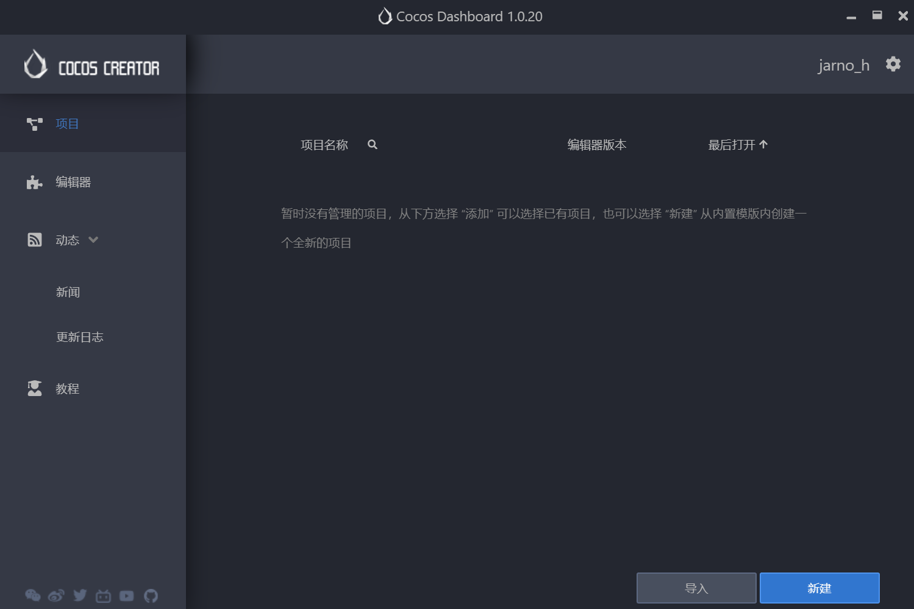

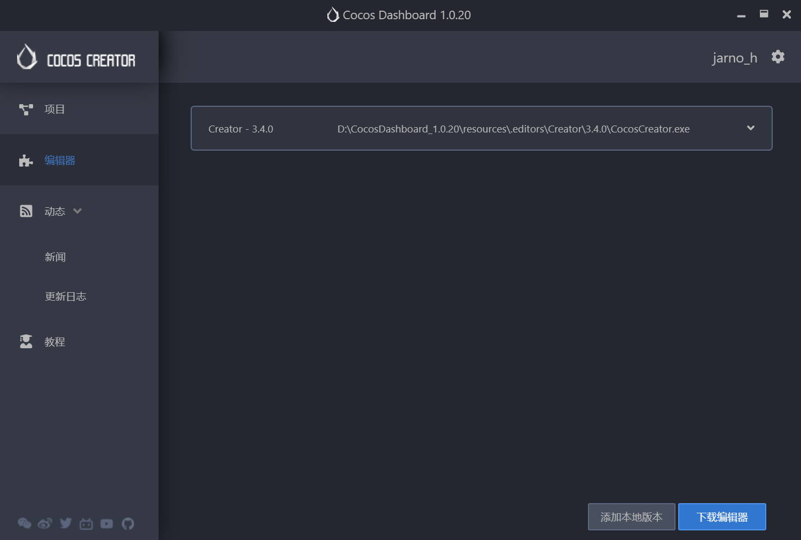

上图所示的就是 Cocos Dashboard 界面，可以点击右上角的设置图标按钮来指定通过 Dashboard 下载的 Creator 编辑器的存放位置，以及 Dashboard 界面显示的语言等。

Cocos Dashboard 界面主要包括以下几种选项卡：

- **项目**: 列出最近打开项目，第一次运行 Cocos Dashboard 时，这个列表是空的。可以在这个选项卡中新建项目。
- **编辑器**: 列出已下载的所有 Creator 编辑器版本，也可以点击右下角的 **下载** 按钮继续下载编辑器。
- **动态**: 用于发布 Cocos Creator 的一些官方信息或者活动等，包括 **公告**、**新闻** 和 **更新日志** 三部分内容。
- **教程**: 帮助信息，一个包括各种新手指引信息和文档的静态页面。

### 项目

可以通过 **项目** 选项卡快速访问近期打开过的项目，点击具体的项目条目时，即可打开该项目

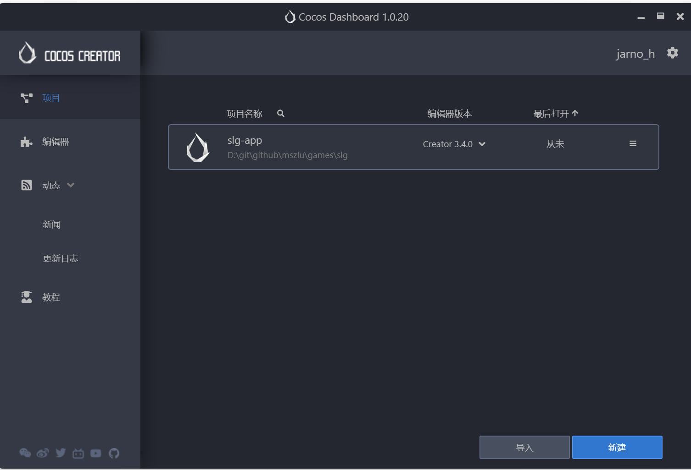

1.  包括 **使用其他编辑器打开项目**、**打开项目所在文件夹**、**从列表中移除**、**选择项目的图标**、**设置项目的描述** 和 **重命名项目** 等功能。
   - **选择项目的图标**：项目图标目前支持 BMP、PNG、GIF、JPG 四种格式（Dashboard 1.0.12 新增）。
   - **重命名项目**：重命名项目将重命名项目文件夹（Dashboard 1.0.12 新增）。
   - **设置项目的描述**：项目备注记录在项目目录下 `package.json` 文件的 `description` 字段中（Dashboard 1.0.19 新增）。
2. 可选择其他编辑器打开项目
3. 可根据时间正序/反序排列项目（Dashboard 1.0.12 新增）。
4. 可通过项目名称直接搜索项目（Dashboard 1.0.12 新增）。
5. **导入** 按钮 — 用于导入其他项目。从 **v1.0.13** 开始，支持直接将项目从操作系统的文件管理器拖拽到列表中。
6. **新建** 按钮 — 用于新建项目，点击该按钮后会进入 **新建项目** 页面，详情可参考下方介绍

### 新建项目

在新建项目页面，点击上方的 **类型** 和 **编辑器版本** 可选择 Creator 的引擎和编辑器版本。

Creator 提供了一些项目模板，包括了各种不同类型的游戏基本架构，以及学习用的范例资源和脚本，来帮助开发者更快进入到创造性的工作当中。

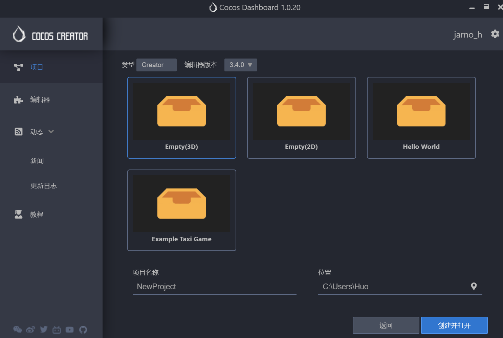

点击选择其中一个项目模板，在页面下方可以看到 **项目名称** 和 **项目存放位置**。

- **项目名称**：项目名称只能包含 **a-z**、**A-Z**、**0-9** 以及 **_** 和 **-**。
- **项目存放位置**：点击项目路径输入框后面的图标即可选择项目的存放路径。

一切都设置好后，点击 **创建并打开** 按钮来完成项目的创建。Dashboard 界面会被关闭，然后新创建的项目会在 Cocos Creator 编辑器主窗口中打开。

### 编辑器

该页面会列出已下载安装的所有 Creator 编辑器版本。

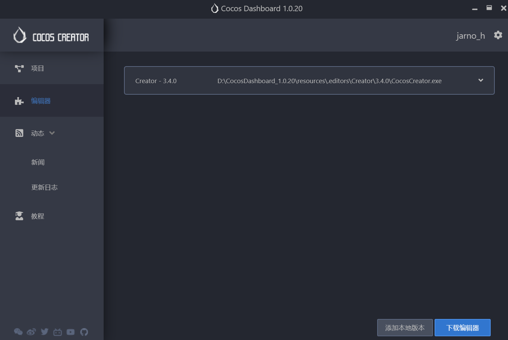

需要注意的是，第一次运行 Cocos Dashboard 时，这个列表是空的，可以点击右下角的两个按钮导入本地已有的 Creator 编辑器或者直接下载安装。

- **添加本地版本**：用于添加本地已有的 Creator 编辑器到 **编辑器** 版本列表。从 **v1.0.13** 开始，支持直接将本地已有的 Creator 编辑器从操作系统的文件管理器拖拽到 **编辑器** 版本列表中。
- **下载编辑器**：点击该按钮会跳转到编辑器下载页面，该页面会列出所有已安装和未安装的编辑器版本，可选择所需的编辑器版本进行下载。

## 5. 项目

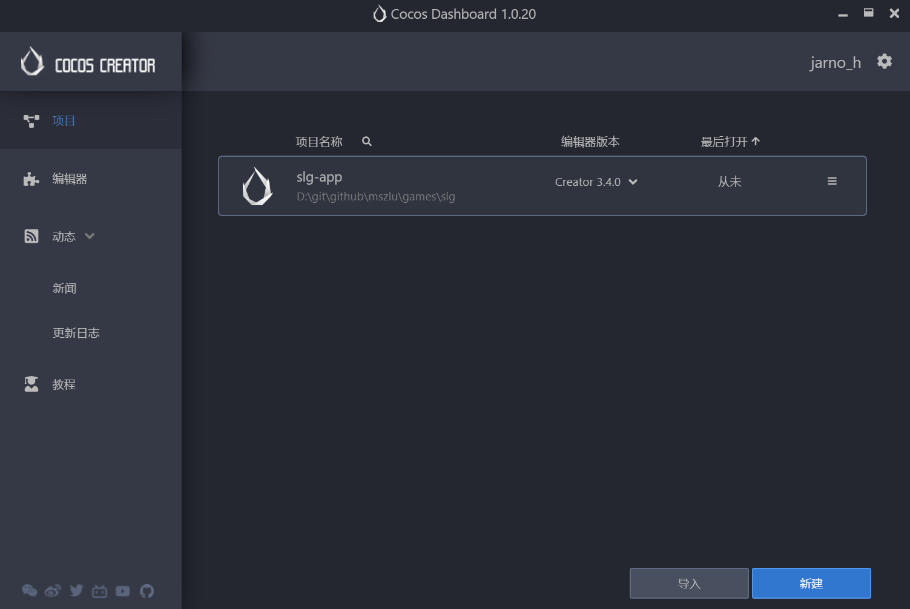

导入项目，双击打开。

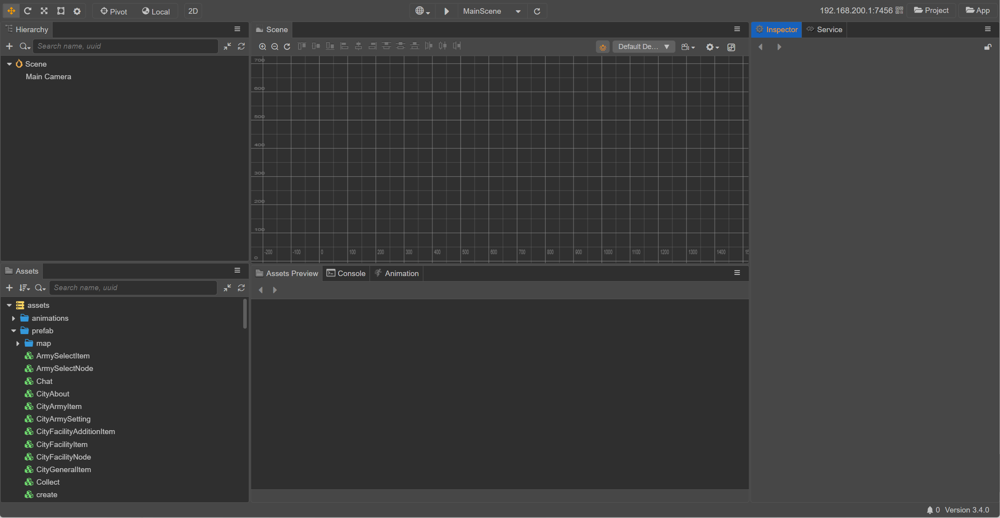

- **资源管理器**：显示了项目资源文件夹（`assets`）中的所有资源。
- **场景编辑器**：用于展示和编辑场景中可视内容的工作区域。
- **层级管理器**：用树状列表的形式展示场景中的所有节点和它们的层级关系，所有在 **场景编辑器** 中看到的内容都可以在 **层级管理器** 中找到对应的节点条目
- **属性检查器**：用于查看并编辑当前选中节点及其组件属性的工作区域
- **资源预览**：在 **资源管理器** 中选中资源，即可在 **资源预览** 面板中显示资源的缩略图。若选中资源所在的文件夹，即可显示文件夹下所有资源的缩略图，方便查看。
- **动画编辑器**：用于制作一些不太复杂的、需要与逻辑进行联动的动画，例如 UI 动画。
- **控制台**：用于显示报错、警告或其他 Cocos Creator 编辑器和引擎生成的日志信息。

关于编辑器各个面板，具体的内容请参考 [编辑器面板](http://docs.cocos.com/creator/manual/zh/editor/)。

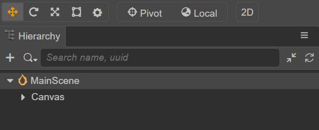

选择MainScene，然后

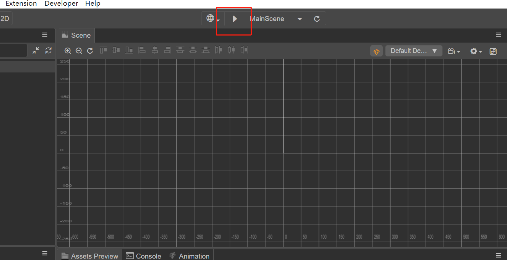

预览场景，即可启动游戏前端。

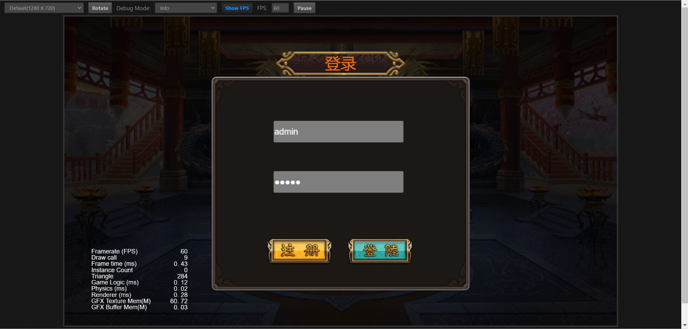

## 6. 游戏截图

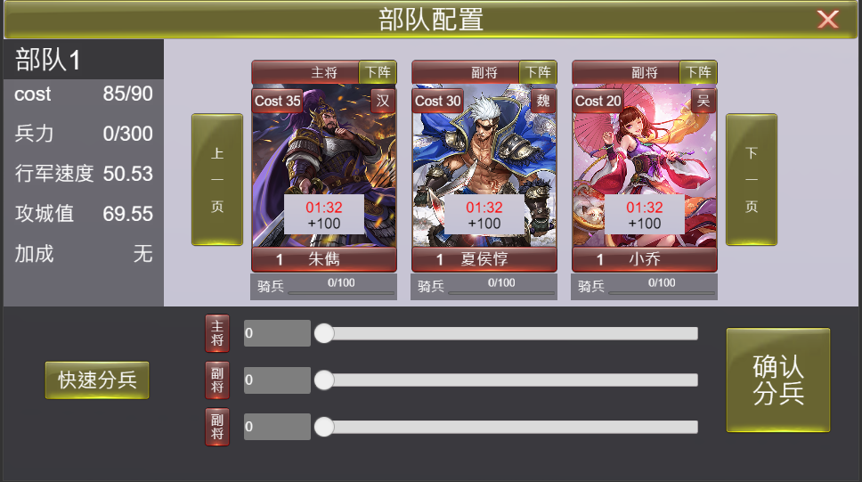

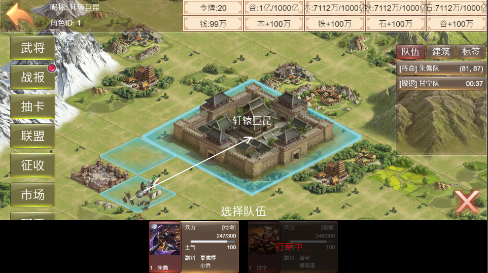

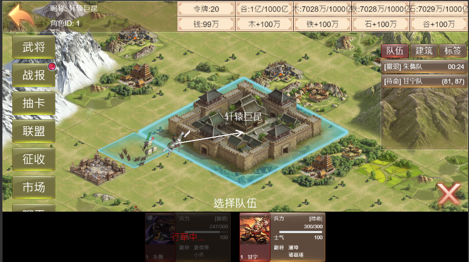

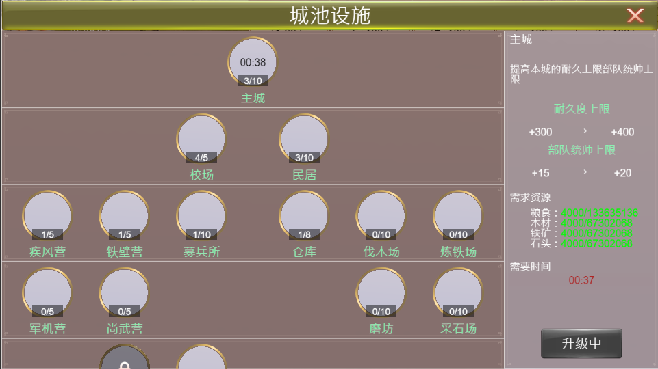


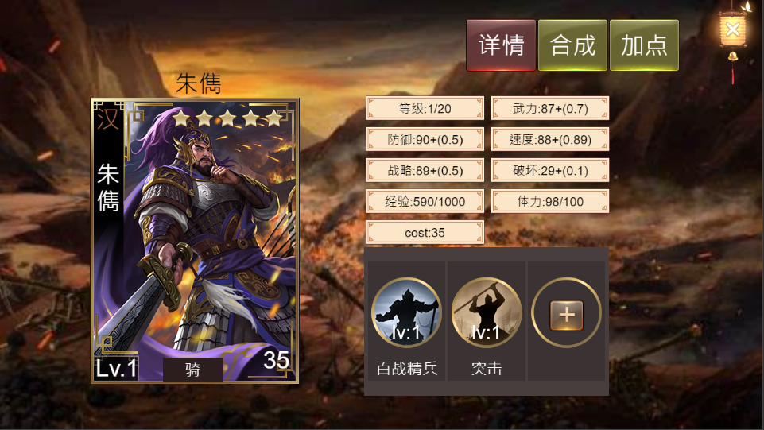

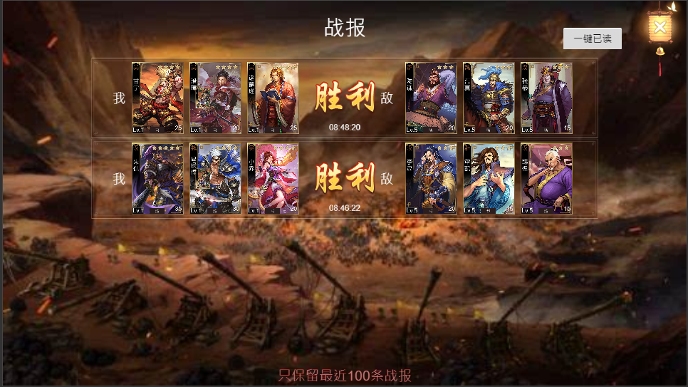

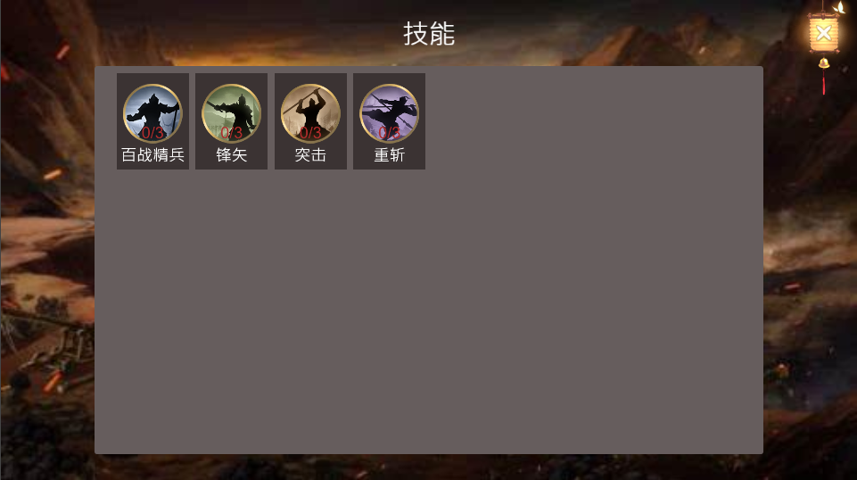

## 7. 项目文件夹结构

初次创建并打开一个 Cocos Creator 项目后，开发者项目文件夹的结构如下：

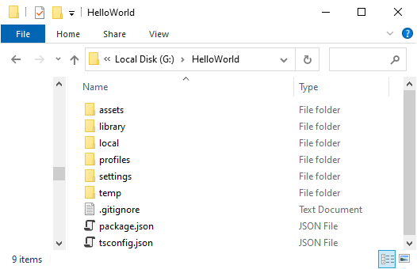

- `assets`：资源目录
- `build`：构建目录（在构建某平台后会生成该目录）
- `library`：导入的资源目录
- `local`：日志文件目录
- `profiles`：编辑器配置
- `temp`：临时文件目录
- `package.json`：项目配置

### 资源文件夹（assets）

`assets` 用来放置游戏中所有的本地资源、脚本和第三方库文件。只有在 `assets` 目录下的内容才能显示在 **资源管理器** 中。`assets` 中的每个文件在导入项目后都会生成一个相同名字的 `.meta` 文件，用于存储对应的资源配置和索引信息。`.meta` 文件需要一并提交到版本控制系统，详见 [资源管理注意事项 --- meta 文件](http://docs.cocos.com/creator/manual/zh/asset/meta.html)。

一些第三方工具生成的工程或设计源文件，如 TexturePacker 的 `.tps` 文件，或 Photoshop 的 `.psd` 文件，可以选择放在 `assets` 外面管理。

### 构建目标（build）

在使用编辑器主菜单中的 **项目 -> 构建发布** 使用默认发布路径发布项目后，编辑器会在项目路径下创建 `build` 目录，并存放所有目标平台的构建工程。

### 资源库（library）

`library` 是将 `assets` 中的资源导入后生成的，在这里文件的结构和资源的格式将被处理成最终游戏发布时需要的形式。

当 `library` 丢失或损坏的时候，只要删除整个 `library` 文件夹再打开项目，就会重新生成资源库。

### 本地设置（local）

`local` 文件夹中包含该项目的本机上的配置信息，包括编辑器面板布局、窗口大小、位置等信息。开发者不需要关心这里的内容。

### 编辑器配置（profiles）

`profiles` 文件夹中包含编辑器的配置信息，包括各目标平台的构建配置信息、场景配置信息等。

### 扩展插件文件夹（extensions）

`extensions` 文件夹用于放置此项目的自定义扩展插件。如果需要手动安装扩展插件，可以手动创建该文件夹。如需卸载扩展插件，在 `extensions` 中删除对应的文件夹即可。

### 项目设置（settings）

`settings` 里保存特定项目相关的设置，如 **项目设置** 面板中相关的配置信息等。如果需要在不同开发者之间同步项目设置，请将 settings 目录加入到版本控制。

### 临时文件夹（temp）

`temp` 是临时文件夹，用于缓存一些 Cocos Creator 在本地的临时文件。这个文件夹可以在关闭 Cocos Creator 后手动删除，开发者不需要关心这里面的内容。

### package.json

`package.json` 文件和 `assets` 文件夹一起，作为验证 Cocos Creator 项目合法性的标志，只有包括了这两个内容的文件夹才能作为 Cocos Creator 项目打开。开发者不需要关心里面的内容。

## 8. 版本控制

Cocos Creator 在新建项目时，会自动生成 `.gitignore` 文件，用于排除不应该提交到 git 仓库的文件。如果开发者使用其它版本控制系统，或者需要提交项目到其它地方，应该注意只需要提交 `assets`、`extensions`、`settings`、`package.json`，或其它手动添加的关联文件。