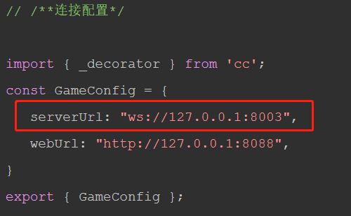

# 登录注册

## 1. 统一配置

> 在我们开发应用的时候，会有一些公用的配置，比如数据库配置，服务器端口配置等等的，这些配置在不同的环境下，需要修改，还有一些配置比如技能配置，武将配置等等和业务相关的，这些配置较为固定，但是不同的版本可能都会进行对应的修改，如果将这些配置写死在代码中，显然是不合适的，我们需要将其定义在统一的配置文件中，程序进行读取配置即可。
>
> 这也是最通俗的做法。

这里我们选用https://github.com/unknwon/goconfig。

中文文档地址：https://github.com/unknwon/goconfig/blob/master/README_ZH.md

### 1.1 构建配置文件

在项目新建conf目录，在其中新建conf.ini配置文件

~~~ini
[login_server]
host=127.0.0.1
port=8003
~~~

```go
go get github.com/Unknwon/goconfig
```

### 1.2 配置初始化

~~~go
package config

import (
	"errors"
	"fmt"
	"github.com/Unknwon/goconfig"
	"log"
	"os"
)

const configFile = "/conf/conf.ini"

var File *goconfig.ConfigFile
//加载此文件的时候 会先走初始化方法
func init()  {
	//拿到当前的程序的目录
	currentDir, err := os.Getwd()
	if err != nil {
		panic(err)
	}
	configPath := currentDir + configFile

	if !fileExist(configPath) {
		panic(errors.New("配置文件不存在"))
	}
	//参数  mssgserver.exe  D:/xxx
	len := len(os.Args)
	if len > 1 {
		dir := os.Args[1]
		if dir != "" {
			configPath = dir + configFile
		}
	}
	//文件系统的读取 
	File,err = goconfig.LoadConfigFile(configPath)
	if err != nil {
		log.Fatal("读取配置文件出错:",err)
	}
}

func fileExist(fileName string) bool {
	_,err := os.Stat(fileName)
	return err == nil || os.IsExist(err)
}
~~~

## 2. 构建web服务

前端：



在前端和后端交互的时候，使用的是websocket协议，所以我们需要处理http和websocket。

> 这里，我们不使用市面上的web框架（现有的框架对websocket支持度不好），自行来封装一个


### 2.1 server和router

> 一个web服务框架必定有server和router

由于要用到websocket

~~~go
go get github.com/gorilla/websocket
~~~

~~~go
package net

import (
	"github.com/gorilla/websocket"
	"log"
	"net/http"
)

type server struct {
	addr string
	router *Router
}

func NewServer(addr string) *server  {
	return &server{
		addr: addr,
	}
}
func (s *server) Router(router *Router) {
	s.router = router
}
//启动服务
func (s *server) Start()  {
	http.HandleFunc("/",s.wsHandler)
	err := http.ListenAndServe(s.addr,nil)
	if err != nil {
		panic(err)
	}
}

// http升级websocket协议的配置
var wsUpgrader = websocket.Upgrader{
	// 允许所有CORS跨域请求
	CheckOrigin: func(r *http.Request) bool {
		return true
	},
}

func (s *server) wsHandler(w http.ResponseWriter, r *http.Request)  {
	//思考 websocket
	//1. http协议升级为websocket协议
	wsConn,err := wsUpgrader.Upgrade(w,r,nil)

	if err != nil {
		//打印日志 同时 退出应用程序
		log.Println("websocket服务连接出错",err)
	}
	//websocket通道建立之后 不管是客户端还是服务端 都可以收发消息
	//发消息的时候 把消息当做路由 来去处理 消息是有格式的，先定义消息的格式
	//客户端 发消息的时候 {Name:"account.login"} 收到之后 进行解析 认为想要处理登录逻辑

	wsServer := NewWsServer(wsConn)
	wsServer.Router(s.router)
	wsServer.Start()
	wsServer.Handshake()
}


~~~

~~~go
package net

import "strings"

//account login||logout

type HandlerFunc func(req *WsMsgReq, rsp *WsMsgRsp)

type group struct {
	prefix string
	handlerMap map[string]HandlerFunc
}

func (g *group) AddRouter(name string,handlerFunc HandlerFunc)  {
	g.handlerMap[name] = handlerFunc
}

func (r *Router) Group(prefix string) *group {
	g := &group{
		prefix: prefix,
		handlerMap: make(map[string]HandlerFunc),
	}
	r.group = append(r.group,g)
	return g
}
func (g *group) exec(name string, req *WsMsgReq, rsp *WsMsgRsp) {
	h := g.handlerMap[name]
	if h != nil {
		h(req,rsp)
	}
}

type Router struct {
	group []*group
}

func NewRouter() *Router  {
	return &Router{}
}

func (r *Router) Run(req *WsMsgReq, rsp *WsMsgRsp) {
	//req.Body.Name 路径 登录业务 account.login （account组标识）login 路由标识
	strs := strings.Split(req.Body.Name,".")
	prefix := ""
	name := ""
	if len(strs) == 2 {
		prefix = strs[0]
		name = strs[1]
	}
	for _,g := range r.group{
		if g.prefix == prefix {
			g.exec(name,req,rsp)
		}
	}
}

~~~

~~~go
package net

import (
	"encoding/json"
	"errors"
	"github.com/forgoer/openssl"
	"github.com/gorilla/websocket"
	"log"
	"mssgserver/utils"
	"sync"
)

//websocket服务
type wsServer struct {
	wsConn *websocket.Conn
	router *Router
	outChan chan *WsMsgRsp
	Seq			int64
	property 	map[string]interface{}
	propertyLock sync.RWMutex
}

func NewWsServer(wsConn *websocket.Conn) *wsServer {
	return &wsServer{
		wsConn: wsConn,
		outChan: make(chan *WsMsgRsp, 1000),
		property: make(map[string]interface{}),
		Seq: 0,
	}
}

func (w *wsServer) Router(router *Router)  {
	w.router = router
}

func (w *wsServer) SetProperty(key string, value interface{}){
	w.propertyLock.Lock()
	defer w.propertyLock.Unlock()
	w.property[key] = value
}

func (w *wsServer) GetProperty(key string) (interface{}, error){
	w.propertyLock.RLock()
	defer w.propertyLock.RUnlock()
	if value, ok := w.property[key]; ok {
		return value, nil
	} else {
		return nil, errors.New("no property found")
	}
}
func (w *wsServer) RemoveProperty(key string){
	w.propertyLock.Lock()
	defer w.propertyLock.Unlock()
	delete(w.property,key)
}
func (w *wsServer) Addr() string {
	return w.wsConn.RemoteAddr().String()
}
func (w *wsServer) Push(name string, data interface{}){
	rsp := &WsMsgRsp{Body: &RspBody{Name: name, Msg: data, Seq: 0}}
	w.outChan <- rsp
}

//通道一旦建立 ，那么 收发消息 就得要一直监听才行
func (w *wsServer) Start() {
	//启动读写数据的处理逻辑
	go w.readMsgLoop()
	go w.writeMsgLoop()
}

func (w *wsServer) writeMsgLoop() {
	for  {
		select {
		case msg := <- w.outChan:
			w.Write(msg)
		}
	}
}

func (w *wsServer) Write(msg *WsMsgRsp) {
	data ,err := json.Marshal(msg.Body)
	if err != nil {
		log.Println(err)
	}
	secretKey,err := w.GetProperty("secretKey")
	if err == nil {
		//有加密
		key := secretKey.(string)
		//数据做加密
		data, _ = utils.AesCBCEncrypt(data, []byte(key), []byte(key), openssl.ZEROS_PADDING)
	}
	//压缩
	if data, err := utils.Zip(data); err == nil{
		w.wsConn.WriteMessage(websocket.BinaryMessage,data)
	}
}

func (w *wsServer) readMsgLoop() {
	//先读到客户端 发送过来的数据，然后 进行处理，然后在回消息
	//经过路由 实际处理程序
	defer func() {
		if err := recover(); err != nil {
			log.Fatal(err)
			w.Close()
		}
	}()
	for  {
		_, data, err := w.wsConn.ReadMessage()
		if err != nil {
			log.Println("收消息出现错误:",err)
			break
		}
		//收到消息 解析消息 前端发送过来的消息 就是json格式
		//1. data 解压 unzip
		data,err = utils.UnZip(data)
		if err != nil {
			log.Println("解压数据出错，非法格式：",err)
			continue
		}
		//2. 前端的消息 加密消息 进行解密
		secretKey,err := w.GetProperty("secretKey")
		if err == nil {
			//有加密
			key := secretKey.(string)
			//客户端传过来的数据是加密的 需要解密
			d, err := utils.AesCBCDecrypt(data, []byte(key), []byte(key), openssl.ZEROS_PADDING)
			if err != nil {
				log.Println("数据格式有误，解密失败:",err)
				//出错后 发起握手
				w.Handshake()
			}else{
				data = d
			}
		}
		//3. data 转为body
		body := &ReqBody{}
		err = json.Unmarshal(data,body)
		if err != nil {
			log.Println("数据格式有误，非法格式:",err)
		}else{
			// 获取到前端传递的数据了，拿上这些数据 去具体的业务进行处理
			req := &WsMsgReq{Conn: w, Body: body}
			rsp := &WsMsgRsp{Body: &RspBody{Name: body.Name, Seq: req.Body.Seq}}
			w.router.Run(req,rsp)
			w.outChan <- rsp
		}
	}
	w.Close()
}

func (w *wsServer) Close()  {
	_ = w.wsConn.Close()
}
const HandshakeMsg = "handshake"

//当游戏客户端 发送请求的时候 会先进行握手协议
//后端会发送对应的加密key给客户端
//客户端在发送数据的时候 就会使用此key进行加密处理
func (w *wsServer) Handshake()  {
	secretKey := ""
	key,err := w.GetProperty("secretKey")
	if err == nil {
		secretKey = key.(string)
	}else{
		secretKey = utils.RandSeq(16)
	}
	handshake := &Handshake{Key: secretKey}

	body := &RspBody{Name: HandshakeMsg,Msg: handshake}

	if data, err := json.Marshal(body); err == nil {
		if secretKey != "" {
			w.SetProperty("secretKey", secretKey)
		} else {
			w.RemoveProperty("secretKey")
		}
		if data,err := utils.Zip(data); err == nil{
			w.wsConn.WriteMessage(websocket.BinaryMessage,data)
		}
	}
}


~~~

~~~go
package net

type ReqBody struct {
	Seq     int64		`json:"seq"`
	Name 	string 		`json:"name"`
	Msg		interface{}	`json:"msg"`
	Proxy	string		`json:"proxy"`
}

type RspBody struct {
	Seq     int64		`json:"seq"`
	Name 	string 		`json:"name"`
	Code	int			`json:"code"`
	Msg		interface{}	`json:"msg"`
}

type WsMsgReq struct {
	Body	*ReqBody
	Conn	WSConn
}

type WsMsgRsp struct {
	Body*	RspBody
}
//理解为 request请求 请求会有参数 请求中放参数 取参数
type WSConn interface {
	SetProperty(key string, value interface{})
	GetProperty(key string) (interface{}, error)
	RemoveProperty(key string)
	Addr() string
	Push(name string, data interface{})
}

type Handshake struct {
	Key string `json:"key"`
}


~~~


### 2.2 登录模拟

~~~go
package main

import (
	"log"
	"test-game/config"
	"test-game/net"
	"test-game/server/login"
)

func main()  {
	host := config.File.MustValue("login_server","host","127.0.0.1")
	port := config.File.MustValue("login_server","port","8003")
	s := net.NewServer(host+":"+port)
	login.Init()
	s.Router(login.Router)
	s.Start()
	log.Println("登录服务启动成功")
}

~~~

~~~go
package login

import (
	"mssgserver/net"
	"mssgserver/server/login/controller"
)

var Router = net.NewRouter()
func Init()  {
	//还有别的初始化方法
	initRouter()
}

func initRouter()  {
	controller.DefaultAccount.Router(Router)
}

~~~

~~~go
package proto

type LoginRsp struct {
	Username 	string    	`json:"username"`
	Password 	string    	`json:"password"`
	Session	 	string		`json:"session"`
	UId			int			`json:"uid"`
}

type LoginReq struct {
	Username 	string    	`json:"username"`
	Password 	string    	`json:"password"`
	Ip		 	string		`json:"ip"`
	Hardware	string		`json:"hardware"`
}

~~~

~~~go
package controller

import (
	"mssgserver/net"
	"mssgserver/server/login/proto"
)

var DefaultAccount = &Account{}
type Account struct {

}

func (a *Account) Router(r *net.Router)  {
	g := r.Group("account")
	g.AddRouter("login",a.login)
}

func (a *Account) login(req *net.WsMsgReq, rsp *net.WsMsgRsp)  {
	rsp.Body.Code = 0
	loginRes := &proto.LoginRsp{}
	loginRes.UId = 1
	loginRes.Username = "admin"
	loginRes.Session = "as"
	loginRes.Password = ""
	rsp.Body.Msg = loginRes
}

~~~

## 3 登录业务实现

### 3.1 表

表：

~~~sql
CREATE TABLE `user`  (
  `uid` int(0) UNSIGNED NOT NULL AUTO_INCREMENT,
  `username` varchar(20) CHARACTER SET utf8mb4 COLLATE utf8mb4_0900_ai_ci NOT NULL COMMENT '用户名',
  `passcode` char(12) CHARACTER SET utf8mb4 COLLATE utf8mb4_0900_ai_ci NOT NULL DEFAULT '' COMMENT '加密随机数',
  `passwd` char(64) CHARACTER SET utf8mb4 COLLATE utf8mb4_0900_ai_ci NOT NULL DEFAULT '' COMMENT 'md5密码',
  `status` tinyint(0) UNSIGNED NOT NULL DEFAULT 0 COMMENT '用户账号状态。0-默认；1-冻结；2-停号',
  `hardware` varchar(64) CHARACTER SET utf8mb4 COLLATE utf8mb4_0900_ai_ci NOT NULL DEFAULT '' COMMENT 'hardware',
  `ctime` timestamp(0) NOT NULL DEFAULT '2013-03-15 14:38:09',
  `mtime` timestamp(0) NOT NULL DEFAULT CURRENT_TIMESTAMP(0) ON UPDATE CURRENT_TIMESTAMP(0),
  PRIMARY KEY (`uid`) USING BTREE,
  UNIQUE INDEX `username`(`username`) USING BTREE
) ENGINE = InnoDB AUTO_INCREMENT = 2 CHARACTER SET = utf8mb4 COLLATE = utf8mb4_0900_ai_ci COMMENT = '用户信息表' ROW_FORMAT = Dynamic;
~~~

测试数据：

~~~sql
INSERT INTO user(`uid`, `username`, `passcode`, `passwd`, `status`, `hardware`, `ctime`, `mtime`) VALUES (1, 'admin', '123', '30e33d5a27ecbefc44ffb36d02800791', 0, '', '2022-03-15 14:38:09', '2022-01-18 12:45:58');

~~~

~~~sql
CREATE TABLE `login_history`  (
  `id` int(0) UNSIGNED NOT NULL AUTO_INCREMENT,
  `uid` int(0) UNSIGNED NOT NULL DEFAULT 0 COMMENT '用户UID',
  `state` tinyint(0) UNSIGNED NOT NULL DEFAULT 0 COMMENT '登录状态，0登录，1登出',
  `ctime` timestamp(0) NOT NULL DEFAULT CURRENT_TIMESTAMP(0) ON UPDATE CURRENT_TIMESTAMP(0) COMMENT '登录时间',
  `ip` varchar(31) CHARACTER SET utf8mb4 COLLATE utf8mb4_0900_ai_ci NOT NULL DEFAULT '' COMMENT 'ip',
  `hardware` varchar(64) CHARACTER SET utf8mb4 COLLATE utf8mb4_0900_ai_ci NOT NULL DEFAULT '' COMMENT 'hardware',
  PRIMARY KEY (`id`) USING BTREE
) ENGINE = InnoDB AUTO_INCREMENT = 21 CHARACTER SET = utf8mb4 COLLATE = utf8mb4_0900_ai_ci COMMENT = '用户登录表' ROW_FORMAT = Dynamic;
~~~

~~~sql
CREATE TABLE `login_last`  (
  `id` int(0) UNSIGNED NOT NULL AUTO_INCREMENT,
  `uid` int(0) UNSIGNED NOT NULL DEFAULT 0 COMMENT '用户UID',
  `login_time` timestamp(0) NULL DEFAULT NULL COMMENT '登录时间',
  `logout_time` timestamp(0) NULL DEFAULT NULL COMMENT '登出时间',
  `ip` varchar(31) CHARACTER SET utf8mb4 COLLATE utf8mb4_0900_ai_ci NOT NULL DEFAULT '' COMMENT 'ip',
  `is_logout` tinyint(0) UNSIGNED NOT NULL DEFAULT 0 COMMENT '是否logout,1:logout，0:login',
  `session` varchar(255) CHARACTER SET utf8mb4 COLLATE utf8mb4_0900_ai_ci NULL DEFAULT NULL COMMENT '会话',
  `hardware` varchar(64) CHARACTER SET utf8mb4 COLLATE utf8mb4_0900_ai_ci NOT NULL DEFAULT '' COMMENT 'hardware',
  PRIMARY KEY (`id`) USING BTREE,
  UNIQUE INDEX `uid`(`uid`) USING BTREE
) ENGINE = InnoDB AUTO_INCREMENT = 3 CHARACTER SET = utf8mb4 COLLATE = utf8mb4_0900_ai_ci COMMENT = '最后一次用户登录表' ROW_FORMAT = Dynamic;
~~~

### 3.2 数据模型

~~~go
type User struct {
	UId      int       `xorm:"uid pk autoincr"`
	Username string    `xorm:"username" validate:"min=4,max=20,regexp=^[a-zA-Z0-9_]*$"`
	Passcode string    `xorm:"passcode"`
	Passwd   string    `xorm:"passwd"`
	Hardware string    `xorm:"hardware"`
	Status   int       `xorm:"status"`
	Ctime    time.Time `xorm:"ctime"`
	Mtime    time.Time `xorm:"mtime"`
	IsOnline bool      `xorm:"-"`
}
~~~

~~~go
type LoginHistory struct {
	Id       int       `xorm:"id pk autoincr"`
	UId      int       `xorm:"uid"`
	CTime    time.Time `xorm:"ctime"`
	Ip       string    `xorm:"ip"`
	State    int8      `xorm:"state"`
	Hardware string    `xorm:"hardware"`
}
~~~

~~~go
type LoginLast struct {
	Id         int       `xorm:"id pk autoincr"`
	UId        int       `xorm:"uid"`
	LoginTime  time.Time `xorm:"login_time"`
	LogoutTime time.Time `xorm:"logout_time"`
	Ip         string    `xorm:"ip"`
	Session    string    `xorm:"session"`
	IsLogout   int8      `xorm:"is_logout"`
	Hardware   string    `xorm:"hardware"`
}
~~~

### 3.3 xorm

~~~go
package db

import (
	"fmt"
	_ "github.com/go-sql-driver/mysql"
	"log"
	"mssgserver/config"
	"xorm.io/xorm"
)

var Engine *xorm.Engine

func TestDB()  {
	mysqlConfig,err := config.File.GetSection("mysql")
	if err != nil {
		log.Println("数据库配置缺失",err)
		panic(err)
	}
	dbConn := fmt.Sprintf("%s:%s@tcp(%s:%s)/%s?charset=utf8&parseTime=True&loc=Local",
		mysqlConfig["user"],
		mysqlConfig["password"],
		mysqlConfig["host"],
		mysqlConfig["port"],
		mysqlConfig["dbname"],
		)
	Engine, err = xorm.NewEngine("mysql", dbConn)
	if err != nil {
		log.Println("数据库连接失败",err)
		panic(err)
	}
	err = Engine.Ping()
	if err != nil {
		log.Println("数据库ping不通",err)
		panic(err)
	}
	maxIdle := config.File.MustInt("mysql","max_idle",2)
	maxConn := config.File.MustInt("mysql","max_conn",2)
	Engine.SetMaxIdleConns(maxIdle)
	Engine.SetMaxOpenConns(maxConn)
	Engine.ShowSQL(true)
	log.Println("数据库初始化完成...")
}

~~~

配置：

~~~ini
[mysql]
host = 127.0.0.1
port = 3306
user = root
password = root
dbname = mssg
charset = utf8
; 最大空闲连接数
max_idle = 2
; 最大打开连接数
max_conn = 10
~~~

### 3.4 登录逻辑

~~~go
package controller

import (
	"github.com/mitchellh/mapstructure"
	"log"
	"mssgserver/constant"
	"mssgserver/db"
	"mssgserver/net"
	"mssgserver/server/login/model"
	"mssgserver/server/login/proto"
	"mssgserver/utils"
	"time"
)

var DefaultAccount = &Account{}
type Account struct {

}

func (a *Account) Router(r *net.Router)  {
	g := r.Group("account")
	g.AddRouter("login",a.login)
}

func (a *Account) login(req *net.WsMsgReq, rsp *net.WsMsgRsp)  {
	/**
		1. 用户名 密码 硬件id
		2. 根据用户名 查询user表 得到数据
		3. 进行密码比对，如果密码正确 登录成功
	    4. 保存用户登录记录
		5. 保存用户的最后一次登录信息
	    6. 客户端 需要 一个session，jwt 生成一个加密字符串的加密算法
	    7. 客户端 在发起需要用户登录的行为时，判断用户是否合法
	 */
	loginReq := &proto.LoginReq{}
	loginRes := &proto.LoginRsp{}
	mapstructure.Decode(req.Body.Msg,loginReq)
	user := &model.User{}
	ok, err := db.Engine.Table(user).Where("username=?",loginReq.Username).Get(user)
	if err != nil {
		log.Println("用户表查询出错",err)
		return
	}
	if !ok {
		//有没有查出来数据
		rsp.Body.Code = constant.UserNotExist
		return
	}
	pwd := utils.Password(loginReq.Password,user.Passcode)
	if pwd != user.Passwd {
		rsp.Body.Code = constant.PwdIncorrect
		return
	}
	//jwt A.B.C 三部分 A定义加密算法 B定义放入的数据 C部分 根据秘钥+A和B生成加密字符串
	token,_ := utils.Award(user.UId)
	rsp.Body.Code = constant.OK
	loginRes.UId = user.UId
	loginRes.Username = user.Username
	loginRes.Session = token
	loginRes.Password = ""
	rsp.Body.Msg = loginRes

	//保存用户登录记录
	ul := &model.LoginHistory{
		UId: user.UId, CTime: time.Now(), Ip: loginReq.Ip,
		Hardware: loginReq.Hardware, State: model.Login,
	}
	db.Engine.Table(ul).Insert(ul)
	//最后一次登录的状态记录
	ll := &model.LoginLast{}
	ok ,_ = db.Engine.Table(ll).Where("uid=?",user.UId).Get(ll)
	if ok {
		//有数据 更新
		ll.IsLogout = 0
		ll.Ip = loginReq.Ip
		ll.LoginTime = time.Now()
		ll.Session = token
		ll.Hardware = loginReq.Hardware
		db.Engine.Table(ll).Update(ll)
	}else{
		ll.IsLogout = 0
		ll.Ip = loginReq.Ip
		ll.LoginTime = time.Now()
		ll.Session = token
		ll.Hardware = loginReq.Hardware
		ll.UId = user.UId
		_, err := db.Engine.Table(ll).Insert(ll)
		if err != nil {
			log.Println(err)
		}
	}
	//缓存一下 此用户和当前的ws连接
	net.Mgr.UserLogin(req.Conn,user.UId,token)
}

~~~

### 3.5 缓存

~~~go
package net

import "sync"

var Mgr = &WsMgr{
	userCache: make(map[int]WSConn),
}
type WsMgr struct {
	uc sync.RWMutex
	userCache map[int]WSConn
}

func (m *WsMgr) UserLogin(conn WSConn,uid int,token string)  {
	m.uc.Lock()
	defer m.uc.Unlock()
	oldConn := m.userCache[uid]
	if oldConn != nil {
		//有用户登录着呢
		if conn != oldConn {
			//通过旧客户端 有用户抢登录了
			oldConn.Push("robLogin",nil)
		}
	}
	m.userCache[uid] = conn
	conn.SetProperty("uid",uid)
	conn.SetProperty("token",token)
}


~~~

## 4. 注册

注册使用http服务，端口号位8888。

我们这选用现在最为流程的gin：https://gin-gonic.com/zh-cn/docs/

~~~go
go get -u github.com/gin-gonic/gin
~~~

~~~go
package main

import (
	"github.com/gin-gonic/gin"
	"log"
	"mssgserver/config"
	"mssgserver/server/web"
	"net/http"
	"time"
)

func main()  {
	host := config.File.MustValue("web_server","host","127.0.0.1")
	port := config.File.MustValue("web_server","port","8088")

	router := gin.Default()
	//路由
	web.Init(router)
	s := &http.Server{
		Addr:           host+":"+port,
		Handler:        router,
		ReadTimeout:    10 * time.Second,
		WriteTimeout:   10 * time.Second,
		MaxHeaderBytes: 1 << 20,
	}
	err := s.ListenAndServe()
	log.Println(err)
}

~~~

跨域配置：

~~~go
package middleware
import (
	"github.com/gin-gonic/gin"
	"net/http"
)

func Cors() gin.HandlerFunc {
	return func(c *gin.Context) {
		method := c.Request.Method
		c.Header("Access-Control-Allow-Origin", "*")
		c.Header("Access-Control-Allow-Headers", "Content-Type,AccessToken,X-CSRF-Token, Authorization, Token")
		c.Header("Access-Control-Allow-Methods", "POST, GET, OPTIONS")
		c.Header("Access-Control-Expose-Headers", "Content-Length, Access-Control-Allow-Origin, Access-Control-Allow-Headers, Content-Type")
		c.Header("Access-Control-Allow-Credentials", "true")
		//放行所有OPTIONS方法
		if method == "OPTIONS" {
			c.AbortWithStatus(http.StatusNoContent)
		}
		// 处理请求
		c.Next()
	}
}
~~~

~~~go
package web

import (
	"github.com/gin-gonic/gin"
	"mssgserver/db"
	"mssgserver/server/web/controller"
	"mssgserver/server/web/middleware"
)

func Init(router *gin.Engine)  {
	//测试数据库，并且初始化数据库
	db.TestDB()
	//还有别的初始化方法
	initRouter(router)
}

func initRouter(router *gin.Engine) {
	router.Use(middleware.Cors())
	router.Any("/account/register",controller.DefaultAccountController.Register)
}
~~~

~~~go
package controller

import (
	"github.com/gin-gonic/gin"
	"log"
	"mssgserver/constant"
	"mssgserver/server/common"
	"mssgserver/server/web/logic"
	"mssgserver/server/web/model"
	"net/http"
)

var DefaultAccountController = &AccountController{}

type AccountController struct {

}

func (a *AccountController) Register(ctx *gin.Context)  {
	/**
		1. 获取请求参数
		2. 根据用户名 查询数据库是否有 有 用户名已存在 没有 注册
		3. 告诉前端 注册成功即可
	 */
	rq := &model.RegisterReq{}
	err := ctx.ShouldBind(rq)
	if err != nil {
		log.Println("参数格式不合法",err)
		ctx.JSON(http.StatusOK,common.Error(constant.InvalidParam,"参数不合法"))
		return
	}
	//一般web服务 错误格式 自定义
	err = logic.DefaultAccountLogic.Register(rq)
	if err != nil {
		log.Println("注册业务出错",err)
		ctx.JSON(http.StatusOK,common.Error(err.(*common.MyError).Code(),err.Error()))
		return
	}
	ctx.JSON(http.StatusOK,common.Success(constant.OK,nil))
}


~~~

~~~go
package logic

import (
	"log"
	"mssgserver/constant"
	"mssgserver/db"
	"mssgserver/server/common"
	"mssgserver/server/models"
	"mssgserver/server/web/model"
	"mssgserver/utils"
	"time"
)

var DefaultAccountLogic = &AccountLogic{}
type AccountLogic struct {

}

func (l AccountLogic) Register(rq *model.RegisterReq) error {
	username := rq.Username
	user := &models.User{}
	ok,err := db.Engine.Table(user).Where("username=?",username).Get(user)
	if err != nil {
		log.Println("注册查询失败",err)
		return common.New(constant.DBError,"数据库异常")
	}
	if ok {
		//有数据 提示用户已存在
		return common.New(constant.UserExist,"用户已存在")
	}else {
		user.Mtime = time.Now()
		user.Ctime = time.Now()
		user.Username = rq.Username
		user.Passcode = utils.RandSeq(6)
		user.Passwd = utils.Password(rq.Password,user.Passcode)
		user.Hardware = rq.Hardware
		_,err := db.Engine.Table(user).Insert(user)
		if err != nil {
			log.Println("注册插入失败",err)
			return common.New(constant.DBError,"数据库异常")
		}
		return nil
	}
}

~~~

~~~go
package model

type RegisterReq struct {
	Username 	string    	`form:"username" json:"username"`
	Password 	string    	`form:"password" json:"password"`
	Hardware	string		`form:"hardware" json:"hardware"`
}

~~~

~~~go
package common

type Result struct {
	Code int `json:"code"`
	Errmsg string `json:"errmsg"`
	Data interface{} `json:"data"`
}

func Error(code int, msg string)  (r *Result) {
	r = &Result{}
	r.Code = code
	r.Errmsg = msg
	return
}

func Success(code int, data interface{}) (r *Result)  {
	r = &Result{}
	r.Code = code
	r.Data = data
	return
}
~~~

~~~go
package common

type MyError struct {
	code int
	msg string
}

func (m *MyError) Error() string {
	return m.msg
}

func (m *MyError) Code() int {
	return m.code
}

func New(code int,msg string) error  {
	return &MyError{
		code: code,
		msg: msg,
	}
}

~~~

