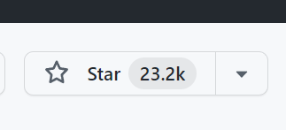
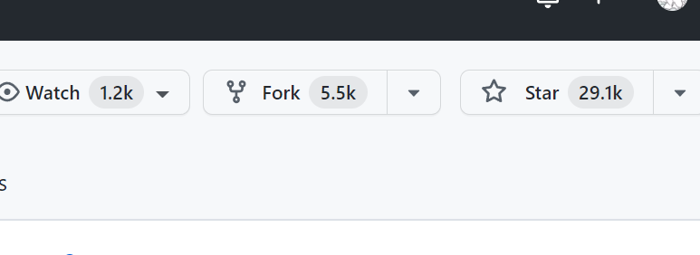

# 认识gin

框架是一系列工具的集合，能让开发变的便捷。

学习框架的目的就是为了提供项目的开发效率，使我们更加专注业务，而不是和业务无关的底层代码。

## 1. go流行的web框架

如果学习过其他语言，可能知道Java用的比较多的是Spring框架，PHP用的比较多的是Laravel，python用的多的是Django，都在各自的语言中具有强大的统治力。

`go`从诞生之初就带有浓重的开源属性，其原生库已经很强大，即使不依赖框架，也能进行高性能开发，又因为其语言并没有一定的设计标准，所以较为灵活，也就诞生了众多的框架，各具有特色，满足不同的喜好。

### 1.1 Gin

地址：https://github.com/gin-gonic/gin

号称最快的go语言web框架，目前是go官方的推荐框架（https://go.dev/doc/tutorial/）。

### 1.2 iris

地址：https://github.com/kataras/iris

性能比gin高一些，支持MVC，但这款框架评价不太好，使用上问题较多，近些年很少去选择使用

### 1.3 Beego

地址：https://github.com/beego/beego 

国人开发，最早的go web框架之一，工具集比较完善，性能较差，据传言作者是php转行，所以框架带有浓厚的php特色，早期国内使用的多，目前少有人选择

### 1.4 fiber

地址：https://github.com/gofiber/fiber

2020年发布的框架，发展迅速，建立在fasthttp之上，性能目前最高，受Express启发，比较简洁，上手较快，和gin类似。

> 当然还有其他一些框架，但从star数上，以及流行程度上看，gin一骑绝尘，gin的好处在于其简洁，扩展性，稳定性以及性能都比较出色。

**go的框架其实是可以理解为库，并不是用了某一个框架就不能用别的框架，可以选择性的使用各个库中的优秀组件，进行组合**

## 2. gin介绍

特性：

**快速**

基于 Radix 树的路由，小内存占用。没有反射。可预测的 API 性能。

**支持中间件**

传入的 HTTP 请求可以由一系列中间件和最终操作来处理。 例如：Logger，Authorization，GZIP，最终操作 DB。

**Crash 处理**

Gin 可以 catch 一个发生在 HTTP 请求中的 panic 并 recover 它。这样，你的服务器将始终可用。例如，你可以向 Sentry 报告这个 panic！

**JSON 验证**

Gin 可以解析并验证请求的 JSON，例如检查所需值的存在。

**路由组**

更好地组织路由。是否需要授权，不同的 API 版本…… 此外，这些组可以无限制地嵌套而不会降低性能。

**错误管理**

Gin 提供了一种方便的方法来收集 HTTP 请求期间发生的所有错误。最终，中间件可以将它们写入日志文件，数据库并通过网络发送。

**内置渲染**

Gin 为 JSON，XML 和 HTML 渲染提供了易于使用的 API。

**可扩展性**

新建一个中间件非常简单。

## 3. 快速入门

go版本需求：go1.13及以上

环境：windows 11

~~~cmd
D:\go\project>mkdir ginlearn
D:\go\project>cd ginlearn
D:\go\project\ginlearn>go work init
D:\go\project\ginlearn>mkdir helloworld
D:\go\project\ginlearn>cd helloworld
D:\go\project\ginlearn\helloworld>go mod init test.com/helloworld
go: creating new go.mod: module test.com/helloworld
D:\go\project\ginlearn\helloworld>cd ..
D:\go\project\ginlearn>go work use ./helloworld
~~~

使用goland（vscode）打开

~~~shell
PS D:\go\project\ginlearn> cd .\helloworld\
#下载并安装gin
PS D:\go\project\ginlearn\helloworld> go get -u github.com/gin-gonic/gin
~~~

示例程序：

~~~go
package main

import "github.com/gin-gonic/gin"

func main() {
	r := gin.Default()
	r.GET("/ping", func(c *gin.Context) {
		c.JSON(200, gin.H{
			"message": "pong",
		})
	})
	r.Run() // 监听并在 0.0.0.0:8080 上启动服务
}

~~~

运行后，postman进行测试

**简单的代码就实现了一个http的服务**