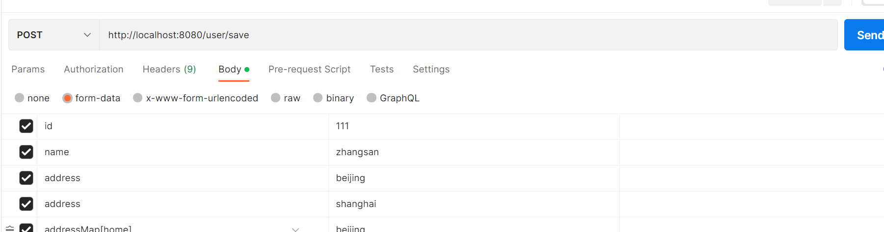

# 请求参数

## 1. Get请求参数

使用Get请求传参时，类似于这样 `http://localhost:8080/user/save?id=11&name=zhangsan`。

如何获取呢？

### 1.1 普通参数

request url: `http://localhost:8080/user/save?id=11&name=zhangsan`

~~~go
r.GET("/user/save", func(ctx *gin.Context) {
		id := ctx.Query("id")
		name := ctx.Query("name")
		ctx.JSON(200, gin.H{
			"id":   id,
			"name": name,
		})
	})
~~~

如果参数不存在，就给一个默认值：

~~~go
r.GET("/user/save", func(ctx *gin.Context) {
		id := ctx.Query("id")
		name := ctx.Query("name")
		address := ctx.DefaultQuery("address", "北京")
		ctx.JSON(200, gin.H{
			"id":      id,
			"name":    name,
			"address": address,
		})
	})
~~~

判断参数是否存在：

~~~go
r.GET("/user/save", func(ctx *gin.Context) {
		id, ok := ctx.GetQuery("id")
		address, aok := ctx.GetQuery("address")
		ctx.JSON(200, gin.H{
			"id":      id,
			"idok":    ok,
			"address": address,
			"aok":     aok,
		})
	})
~~~

id是数值类型，上述获取的都是string类型，根据类型获取：

~~~go
type User struct {
	Id   int64  `form:"id"`
	Name string `form:"name"`
}
r.GET("/user/save", func(ctx *gin.Context) {
		var user User
		err := ctx.BindQuery(&user)
		if err != nil {
			log.Println(err)
		}
		ctx.JSON(200, user)
})
~~~

也可以：

~~~go
r.GET("/user/save", func(ctx *gin.Context) {
		var user User
		err := ctx.ShouldBindQuery(&user)
		if err != nil {
			log.Println(err)
		}
		ctx.JSON(200, user)
	})
~~~

区别：

~~~go
type User struct {
	Id      int64  `form:"id"`
	Name    string `form:"name"`
	Address string `form:"address" binding:"required"`
}
~~~

当bind是必须的时候，ShouldBindQuery会报错，开发者自行处理，状态码不变。

BindQuery则报错的同时，会将状态码改为400。所以一般建议是使用Should开头的bind。

### 1.2 数组参数

请求url：`http://localhost:8080/user/save?address=Beijing&address=shanghai`

~~~go
r.GET("/user/save", func(ctx *gin.Context) {
		address := ctx.QueryArray("address")
		ctx.JSON(200, address)
	})
~~~

~~~go
r.GET("/user/save", func(ctx *gin.Context) {
		address, ok := ctx.GetQueryArray("address")
		fmt.Println(ok)
		ctx.JSON(200, address)
	})
~~~

~~~go
r.GET("/user/save", func(ctx *gin.Context) {
		var user User
		err := ctx.ShouldBindQuery(&user)
		fmt.Println(err)
		ctx.JSON(200, user)
	})
~~~

### 1.3 map参数

请求url：`http://localhost:8080/user/save?addressMap[home]=Beijing&addressMap[company]=shanghai`

~~~go
r.GET("/user/save", func(ctx *gin.Context) {
		addressMap := ctx.QueryMap("addressMap")
		ctx.JSON(200, addressMap)
	})
~~~

~~~go
r.GET("/user/save", func(ctx *gin.Context) {
		addressMap, _ := ctx.GetQueryMap("addressMap")
		ctx.JSON(200, addressMap)
	})
~~~

map参数 bind并没有支持

## 2. Post请求参数

post请求一般是表单参数和json参数

### 2.1 表单参数

~~~go
r.POST("/user/save", func(ctx *gin.Context) {
		id := ctx.PostForm("id")
		name := ctx.PostForm("name")
		address := ctx.PostFormArray("address")
		addressMap := ctx.PostFormMap("addressMap")
		ctx.JSON(200, gin.H{
			"id":         id,
			"name":       name,
			"address":    address,
			"addressMap": addressMap,
		})
	})
~~~

~~~go
r.POST("/user/save", func(ctx *gin.Context) {
		var user User
		err := ctx.ShouldBind(&user)
		addressMap, _ := ctx.GetPostFormMap("addressMap")
		user.AddressMap = addressMap
		fmt.Println(err)
		ctx.JSON(200, user)
	})
~~~

### 2.2 json参数

~~~json
{
    "id":1111,
    "name":"zhangsan",
    "address": [
        "beijing",
        "shanghai"
    ],
    "addressMap":{
        "home":"beijing"
    }
}
~~~

~~~go
r.POST("/user/save", func(ctx *gin.Context) {
		var user User
		err := ctx.ShouldBindJSON(&user)
		fmt.Println(err)
		ctx.JSON(200, user)
	})
~~~

其他类型参数注入xml，yaml等和json道理一样

## 3. 路径参数

请求url：`http://localhost:8080/user/save/111`

~~~go
r.POST("/user/save/:id", func(ctx *gin.Context) {
		ctx.JSON(200, ctx.Param("id"))
	})
~~~

## 4. 文件参数

~~~go
r.POST("/user/save", func(ctx *gin.Context) {
		form, err := ctx.MultipartForm()
		if err != nil {
			log.Println(err)
		}
		files := form.File
		for _, fileArray := range files {
			for _, v := range fileArray {
				ctx.SaveUploadedFile(v, "./"+v.Filename)
			}

		}
		ctx.JSON(200, form.Value)
	})
~~~

